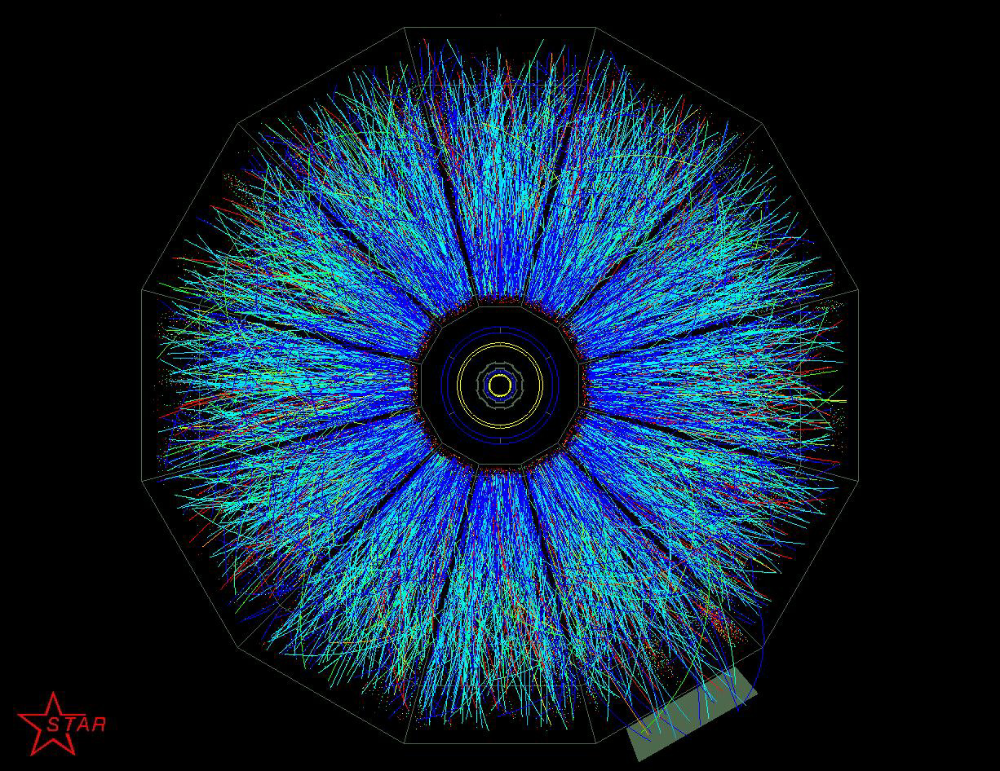

  


<h2 align = 'center'> Welcome to the UCL High Energy Physics (HEP) Department. </h2>
<h3 align = "center">   </h3>


UCL HEP is one of the largest groups in the country with research areas spanning: theory/phenomenology, detector, software and accelerator R&D and analysis of data from the LHC, dark matter and neutrino experiments.


## in2HEP

For the next three days you will be learning about UCL HEP's involvement in cutting edge research into the fundamental fabric of the universe. This webpage will host resources, instructions and guides on some of the work you have done whilst at UCL. 

To get started, download and unzip the resource file below:

- Download the resources for this tutorial here: <a href = ' https://github.com/ishank95/in2HEP/archive/master.zip' > Resource File </a>
- **Note: Make sure you unzip the file**

or using git from command line:

```
git clone https://ishank95.github.io/in2HEP/
```

- The tutorials are in the form of Jupyter notebooks and we will be using Python 3 throughout the exercises. To open a Jupyter notebook, type _Jupyter_ in the start menu and hit enter. 

#### Python Crash Course (optional)
If you are not familiar with Python, please look at the Python Crash Course notebook first. If you are familiar with Python but have never used the pandas library before, it is worth looking at the _Introduction to Pandas_ section in the Crash Course notebook. 

The easiest way to install Python on your own computers at home is to use the Anaconda Installer found here: https://www.anaconda.com/download


#### Intro to HEP

#### Intro to Collider Physics and ATLAS

Here are the slides for the talk you heard from CERN Physicist Dr Andrew bell. 

https://cernbox.cern.ch/index.php/s/oZm7hZDjiJY2h0g#pdfviewer

#### ATLAS Cut-Based Analysis

The search for Higgs to bb is crucial to studying the Standard Model Higgs and understanding how the Higgs boson couples to quarks. In this tutorial you will be developing a cut based analysis on Monte Carlo generated ATLAS data to study the Higgs Boson decay to a pair of _b_-quarks.

The notebook for this section is titled _ATLAS Cut-Based Analysis_.


### ATLAS Machine Learning

As promised, we will be extending the ATLAS analysis to one that includes machine learning techniques. Specifically, Boosted Decision Trees. We will learn how machine learning algorithms can improve our sensitivity to signal by maximising the information extracted from data.

The notebook for this section is titled _ATLAS Machine Learning._.

### Dark Matter @ UCL

Tomorrow you will be learning all about Dark Matter and UCL's involvement in the search for Dark Matter. If you are interested here is a talk by UCL Cosmologist Dr Andrew Pontzen given at the Royal Institution on Dark Matter and the Weirdness in the uninverse! 

https://www.youtube.com/watch?v=GFxPMMkhHuA&t=2121s

